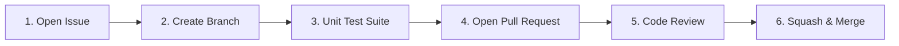

# Contributing to AgentKit

Thank you for your interest in contributing to **AgentKit**! AgentKit is an enterprise-grade multi-agent KPI intelligence engine and official Model Context Protocol (MCP) server.

---

## 📜 Table of Contents

1. [Code of Conduct](#code-of-conduct)
2. [Licensing & Commercial Boundary](#licensing--commercial-boundary)
3. [Developer Certificate of Origin (DCO)](#developer-certificate-of-origin-dco)
4. [Contribution Workflow](#contribution-workflow)
5. [MCP Protocol Standards](#mcp-protocol-standards)
6. [Local Development & Setup](#local-development--setup)
7. [Testing Standards](#testing-standards)
8. [Commit Message Standards](#commit-message-standards)
9. [Security & Vulnerability Disclosure](#security--vulnerability-disclosure)

---

## 🤝 Code of Conduct

All contributors agree to participate in an open, welcoming, and harassment-free community.

---

## ⚖️ Licensing & Commercial Boundary

AgentKit is licensed under the **GNU Affero General Public License v3.0 (AGPL-3.0)**.

- **Open Source Contributions**: All code contributions are submitted under AGPL-3.0.
- **Commercial & Enterprise Licensing**: For organizations requiring closed-source SDK distribution, private SaaS integration, or exemption from AGPL-3.0 copyleft obligations, commercial licenses are available through **OmniIntelOS**. Refer to [`COMMERCIAL.md`](./COMMERCIAL.md) or contact `siddoyacinetech227@gmail.com`.

---

## ✍️ Developer Certificate of Origin (DCO)

All commits must include a Developer Certificate of Origin sign-off line (`git commit -s`):

```bash
git commit -s -m "feat(mcp): add sql execution tool schema validation"
```

---

## 🔌 MCP Protocol Standards

When adding or modifying Model Context Protocol (MCP) tools:
- Tool schemas must adhere strictly to JSON Schema draft-07.
- Every tool must include detailed descriptions for the LLM planner, clear argument typing, and explicit return formats.
- Ensure tool handlers catch internal exceptions and return structured JSON error payloads rather than uncaught stack traces.

---

## 🔄 Contribution Workflow



1. **Issue First**: Open an issue describing the feature or fix.
2. **Branching**: Branch from `master` (`feat/...` or `fix/...`).
3. **Tests**: Run offline unit tests.
4. **Pull Request**: Open PR targeting `master` referencing the issue.

---

## 🛠️ Local Development & Setup

### Prerequisites
- Python 3.11+
- uv (optional, recommended for fast package management)

### Environment Setup
```bash
# 1. Clone repository
git clone https://github.com/Yacine-ai-tech/AgentKit.git
cd AgentKit

# 2. Virtual environment setup
python3 -m venv venv
source venv/bin/activate

# 3. Install in editable mode
pip install -e .
pip install -r requirements.txt

# 4. Copy environment example
cp .env.example .env
```

---

## 🧪 Testing Standards

```bash
pytest tests/ -v
```

- Unit tests must run completely offline without live database connections or LLM API keys.
- MCP tool execution must be verified using mock database cursors and mock agent responses.

---

## 📝 Commit Message Standards

Use [Conventional Commits](https://www.conventionalcommits.org/):

`feat:`, `fix:`, `docs:`, `test:`, `refactor:`, `perf:`, `chore:`

---

## 🔒 Security & Vulnerability Disclosure

For private vulnerability disclosures, email `siddoyacinetech227@gmail.com`.
